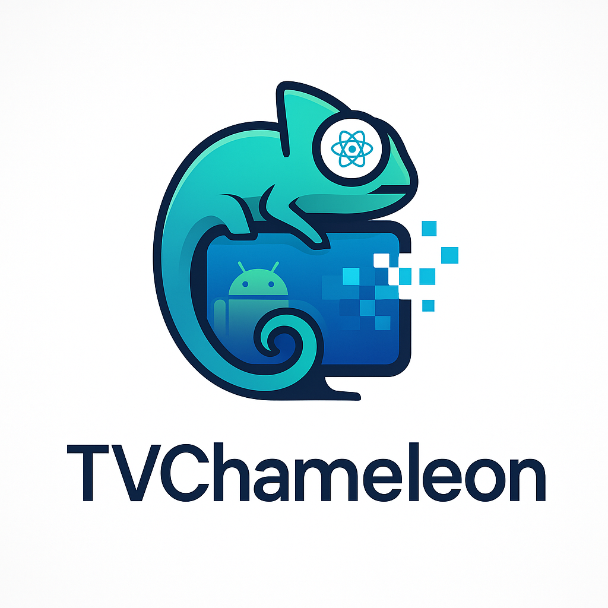

# TVChameleon 🦎

<div align="center">
  
  
  **🦎 Adapting Android TV apps to React Native TV 🦎**
  
  *Seamless cross-platform transformation*
</div>

A comprehensive demonstration of converting native Android TV applications to React Native TV, featuring pixel-perfect UI recreation and responsive design principles.

## 🎯 Project Overview

This repository showcases the complete conversion process from a native Android TV application (using deprecated Leanback library) to a modern React Native TV application with cross-platform capabilities.

### What's Included

- **`MyApplication/`** - Original Android TV app (Java/Kotlin + Leanback)
- **`rntv/`** - Converted React Native TV app (TypeScript + Expo)
- **`android-mcp-server/`** - Python MCP server for Android device automation (uses [android-mcp-server](https://github.com/minhalvp/android-mcp-server))
- **`conversion.md`** - Comprehensive conversion methodology guide

## 🚀 Quick Start

### Prerequisites

- **Java 17** (required for React Native TV builds)
- **Android Studio** with Android TV emulator or physical Android TV device
- **Node.js 18+** and npm
- **Python 3.8+** (for MCP server)
- **ADB** (Android Debug Bridge)

### Setup Instructions

1. **Clone and setup the repository:**
```bash
git clone <repository-url>
cd convai
```

2. **Setup Java 17:**
```bash
# macOS with Homebrew
brew install openjdk@17
export JAVA_HOME=/Library/Java/JavaVirtualMachines/openjdk-17.jdk/Contents/Home

# Or use your preferred JDK 17 installation
```

3. **Setup Android TV device/emulator:**
```bash
# Enable ADB debugging on your Android TV device
# Or create Android TV emulator in Android Studio
adb devices  # Verify device connection
```

## 🧪 Testing the Conversion

### Phase 1: Test Original Android TV App

1. **Build and install the Android TV app:**
```bash
cd MyApplication/
./gradlew assembleDebug
adb install app/build/outputs/apk/debug/app-debug.apk
```

2. **Launch and explore:**
```bash
adb shell am start -n dev.giolaq.myapplication/.MainActivity
```

3. **Take reference screenshots:**
```bash
adb shell screencap -p /sdcard/android_tv_screenshot.png
adb pull /sdcard/android_tv_screenshot.png ./
```

### Phase 2: Test React Native TV App

1. **Setup React Native TV environment:**
```bash
cd rntv/
npm install
```

2. **Build and run on Android TV:**
```bash
export JAVA_HOME=/path/to/java17
EXPO_TV=1 npm run android
```

3. **Launch the app:**
```bash
adb shell am start -n com.giolaq.rntv/.MainActivity
```

### Phase 3: Visual Comparison Testing

1. **Setup MCP server for automated testing:**
```bash
# Clone the Android MCP server
git clone https://github.com/minhalvp/android-mcp-server.git
cd android-mcp-server/
python -m venv .venv
source .venv/bin/activate  # On Windows: .venv\Scripts\activate
pip install -r requirements.txt
```

2. **Run comparison tests:**
```bash
# Switch between apps and compare
adb shell am start -n dev.giolaq.myapplication/.MainActivity
adb shell screencap -p /sdcard/android_original.png

adb shell am start -n com.giolaq.rntv/.MainActivity  
adb shell screencap -p /sdcard/react_native.png

# Pull screenshots for comparison
adb pull /sdcard/android_original.png ./
adb pull /sdcard/react_native.png ./
```

3. **Navigate through screens:**
```bash
# Test navigation flows
adb shell input tap 691 424  # Click on movie card
adb shell input keyevent 23  # Press select/enter
adb shell input keyevent 4   # Press back
```

## 🔍 Key Testing Areas

### UI Layout Verification
- [ ] **Sidebar positioning** - Left sidebar should be 28% of screen width
- [ ] **Movie card sizing** - Normal: 13% width, Focused: 18.6% width  
- [ ] **Title group height** - Should be 21% of screen height
- [ ] **Responsive scaling** - No UI overflow on different screen sizes

### Focus Management Testing
- [ ] **Initial focus** - First movie card should be focused on launch
- [ ] **Navigation** - D-pad navigation between cards works
- [ ] **Focus animations** - 1.14x scale animation on focus
- [ ] **Visual feedback** - Clear focus indicators

### Screen Navigation Testing
- [ ] **Browse to Details** - Clicking movie opens details screen
- [ ] **Details to Playback** - Play button opens video player
- [ ] **Back navigation** - Back button returns to previous screen
- [ ] **Deep linking** - Direct navigation to specific screens

### Performance Testing
- [ ] **Memory usage** - Monitor RAM consumption during navigation
- [ ] **Smooth animations** - 60fps focus transitions
- [ ] **Image loading** - Efficient loading of movie thumbnails
- [ ] **List scrolling** - Smooth horizontal scrolling performance

## 📱 Supported Platforms

### Android TV
- **Minimum SDK:** 21 (Android 5.0)
- **Target SDK:** 34 (Android 14)
- **Tested on:** Android TV emulator, NVIDIA Shield, Fire TV

### React Native TV
- **React Native:** 0.74+
- **Expo:** 51+
- **Platforms:** Android TV, Apple TV (future), Web TV

## 🛠️ Development Workflow

### Making Changes

1. **Modify React Native components:**
```bash
cd rntv/
# Edit components in app/ or components/
npm run android  # Hot reload enabled
```

2. **Test changes:**
```bash
# Take new screenshot
adb shell screencap -p /sdcard/updated.png
# Compare with original Android TV app
```

3. **Verify responsive design:**
```bash
# Test on different screen sizes
# Ensure no UI overflow occurs
```

### Debugging Common Issues

**Build Errors:**
```bash
# Clean and rebuild
cd rntv/android/
./gradlew clean
cd ..
npm run android
```

**Focus Issues:**
```bash
# Check TVEventHandler compatibility
# Simplify focus management if needed
```

**Layout Problems:**
```bash
# Use ADB to inspect UI hierarchy
adb shell uiautomator dump
adb shell cat /sdcard/window_dump.xml
```

## 📊 Performance Benchmarks

### Target Metrics
- **App launch time:** < 3 seconds
- **Screen transitions:** < 300ms
- **Memory usage:** < 200MB
- **Focus response:** < 100ms

### Monitoring Tools
```bash
# Memory usage
adb shell dumpsys meminfo com.giolaq.rntv

# CPU usage  
adb shell top -p $(adb shell pidof com.giolaq.rntv)

# Frame rate
adb shell dumpsys gfxinfo com.giolaq.rntv framestats
```

## 🎨 UI/UX Guidelines

### TV-Specific Design Principles
- **10-foot viewing distance** - Larger fonts and touch targets
- **Focus-driven navigation** - Clear focus indicators
- **Horizontal layouts** - Optimized for landscape orientation
- **Simplified interactions** - Minimal input complexity

### Responsive Design Rules
- Use percentage-based sizing (`screenWidth * 0.28`)
- Avoid fixed pixel values
- Test on multiple screen resolutions
- Ensure safe area compliance

## 🤖 AI-Assisted Conversion

### Using conversion.md as LLM Context

The `conversion.md` file is designed to be used as context for Large Language Models (LLMs) to guide automated conversion:

```bash
# Use conversion.md as context when prompting your LLM
cat conversion.md | pbcopy  # Copy to clipboard (macOS)
```

**Recommended LLM Workflow:**
1. **Load Context**: Provide `conversion.md` as system context to your LLM
2. **Analyze Source**: Share your Android TV code with the LLM
3. **Generate Components**: Ask the LLM to create React Native TV equivalents
4. **Iterate**: Use the debugging process from the guide to refine results

**Example LLM Prompt:**
```
Using the TVChameleon conversion methodology as context, convert this Android TV 
CardPresenter to a React Native TV component with pixel-perfect responsive design:

[Your Android TV code here]
```

This approach leverages the comprehensive methodology to ensure consistent, high-quality conversions.

## 📚 Additional Resources

- **[conversion.md](./conversion.md)** - Complete conversion methodology
- **[Android TV Design Guidelines](https://developer.android.com/design/tv)**
- **[React Native TV Documentation](https://github.com/react-native-tvos/react-native-tvos)**
- **[Expo TV Support](https://docs.expo.dev/guides/tv/)**

## 🤝 Contributing

1. Fork the repository
2. Create a feature branch
3. Test changes on both Android TV and React Native TV
4. Ensure visual parity between implementations
5. Submit pull request with screenshots

## 📄 License

This project is licensed under the MIT License - see the LICENSE file for details.

## 🆘 Troubleshooting

### Common Issues

**Java Version Error:**
```bash
export JAVA_HOME=/Library/Java/JavaVirtualMachines/openjdk-17.jdk/Contents/Home
```

**ADB Connection Issues:**
```bash
adb kill-server
adb start-server
adb devices
```

**React Native Build Failures:**
```bash
cd rntv/
rm -rf node_modules/
npm install
npm run android
```

**UI Overflow Problems:**
- Check responsive sizing implementation
- Verify Dimensions API usage
- Test on different screen sizes

For more detailed troubleshooting, refer to the [conversion.md](./conversion.md) guide.
